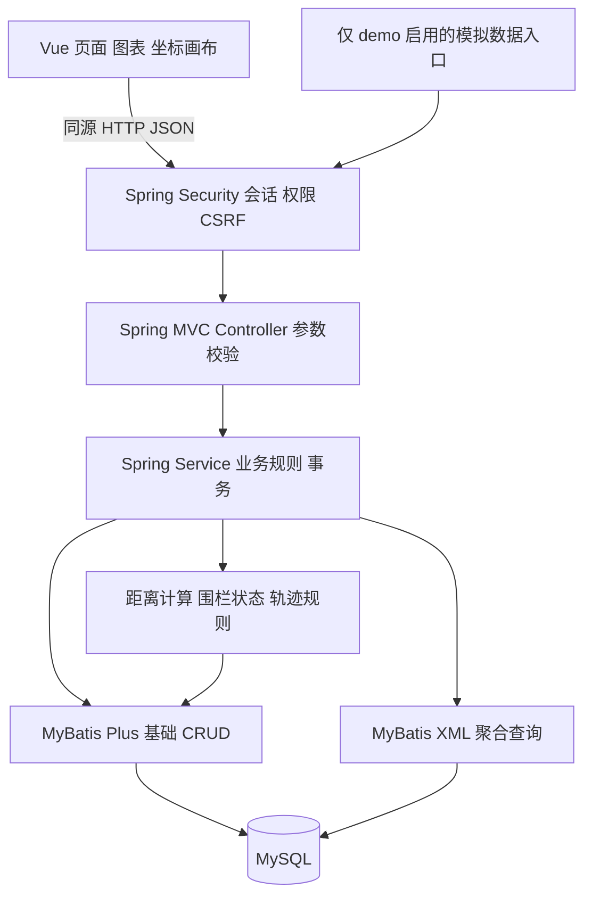

# 智慧医养大数据决策分析系统需求与设计评审

版本：0.2　日期：2026-09-07　状态：总体设计获认可 技术基线调整为 Spring Boot 3

本稿记录项目组的实现范围、页面组织、权限和数据规则。用户已认可总体设计方向：四人协作、不设独立 Agent 岗位、使用模拟数据、采用 Maven、第 8 项文档调整为系统详细设计说明书，并新增项目部署环境说明书。本次根据团队 IDEA 环境约束改用 Spring Boot 3。本文业务规则作为后续实现基线，尚非已实现能力。

## 1 项目边界

建设面向医养服务管理人员的浏览器端系统，完成登录、首页、人口信息统计分析、健康检测统计分析、医生随访统计分析、腕表分布、电子围栏、轨迹回放。配套提供老人档案、医生、设备和随访计划维护，以形成数据录入到统计展示的闭环。

第一版覆盖单个管理单位及其地区数据，不实现跨租户平台。默认以明确标注的虚构数据演示，腕表数据通过后端模拟器产生。真实设备协议对接、短信推送、AI 问答及分布式计算列为后续扩展，不计入第一版验收。

成员姓名、交付截止日期、学校模板暂待补充，不阻碍设计；具体日历排期在截止日期确定后制定。

## 2 技术与工程组织

保留根目录 Maven 工程和 com.johnnylin.dev 包名，后端采用 Spring Boot 3.5.16、Spring MVC、Spring 事务与依赖注入。团队使用 IDEA 2024 系列及更早版本，按用户要求统一使用 Spring Boot 3 与 JUnit 5 技术线。项目 Java 编译目标保持 17，团队开发 SDK 基线为 JDK 17；本机 JDK 25 的编译与运行结果需单独记录，不能冒充 JDK 17 或 IDEA 内置测试运行器实测结果。

MyBatis-Plus 拟使用 mybatis-plus-spring-boot3-starter，基础 CRUD 采用 BaseMapper，聚合统计使用 MyBatis Mapper XML。两者在同一数据访问层使用，不重复配置独立的 MyBatis starter。数据库采用 MySQL 8.0，前端采用 Vue 3，前端依赖由 npm 管理，后端编译、测试和打包由 Maven 管理。

Web 依赖使用 spring-boot-starter-web；测试使用 spring-boot-starter-test 及 test scope 的 junit-platform-launcher，版本统一交给 Spring Boot BOM 管理，不混入 JUnit 6 或单独覆盖 API、Engine、Launcher 版本。验收需分别记录 Maven Surefire 执行 JUnit 测试以及团队实际 IDEA 版本的直接运行结果。“IDEA 2024 及以下”不是无限向下兼容承诺，最终兼容矩阵以实测的完整版本号为准。

```text
dev/
  pom.xml                       Maven 后端工程
  mvnw / mvnw.cmd / .mvn/       Maven Wrapper
  src/main/java/.../            config common auth elder health followup device geo
  src/main/resources/           配置和 mapper XML
  src/test/                     单元测试和接口集成测试
  frontend/                     Vue 页面与构建配置
  database/                     建表、初始化和独立演示数据脚本
  scripts/                      启动、验证和数据生成工具
  docs/review/                  设计评审源稿
  docs/deliverables/             最终 Word 和 PPT
```

本次已将 pom.xml 的父版本、Web 与测试 starter 调整为 Spring Boot 3 方案。后续主体开发再将现有 Data JDBC、Thymeleaf 依赖调整为 MyBatis-Plus 和 Vue 所需方案。应用上下文冒烟测试使用 test scope 的 H2 内存库，不依赖本机 MySQL 账号；MySQL 方言、表结构和统计 SQL 仍需独立集成验证。



## 3 应用角色和权限

项目组岗位与系统登录角色相互独立。第一版系统角色如下。

| 操作 | 管理员 ADMIN | 业务人员 OPERATOR | 分析员 ANALYST |
| --- | --- | --- | --- |
| 查看汇总图表 | 是 | 是 | 是 |
| 查看脱敏业务明细及轨迹 | 是 | 是 | 是 |
| 维护老人和医生 | 是 | 是 | 否 |
| 录入健康与随访记录 | 是 | 是 | 否 |
| 设备绑定及围栏配置 | 是 | 是 | 否 |
| 处理围栏事件 | 是 | 是 | 否 |
| 管理账号角色 | 是 | 否 | 否 |
| 运行演示数据模拟器 | 是且仅 demo 环境 | 否 | 否 |

前后端同时控制权限，后端为最终判定方。认证拟采用 Spring Security 的服务端 Session；退出时注销 Session，写接口校验 CSRF。部署时使用同源访问，开发时由前端代理 /api。密码采用 BCrypt，日志不记录密码和会话凭据。第一版不收集真实身份证号码，电话默认脱敏。

## 4 功能和验收基线

| 编号 | 功能 | 验收要点 |
| --- | --- | --- |
| FR01 | 登录 | 正确凭据进入首页；错误凭据不给出账号存在信息；未登录访问业务 API 返回 401；注销后原会话失效 |
| FR02 | 首页 | 卡片、图表与明细使用一致筛选条件；空数据正常展示；点击卡片进入对应明细 |
| FR03 | 人口 | 档案新增编辑、归档、分页检索；年龄性别地区分组与有效老人总数核对一致 |
| FR04 | 健康 | 记录按老人和时间查询；趋势图使用真实接口；异常筛选与记录中的判定结果一致 |
| FR05 | 随访 | 建立计划、填写结果、查看逾期；同一计划最多一条完成记录；完成率分母清晰 |
| FR06 | 腕表 | 绑定设备与老人；最后有效定位展示；在线与离线均可演示；无定位设备不伪造坐标 |
| FR07 | 围栏 | 圆形围栏维护及人员关联；入库定位触发判断；持续越界不重复报警；处理操作可追溯 |
| FR08 | 轨迹 | 老人和时间范围查询；按时间播放；支持暂停、倍速；标出长时间定位缺口 |

性能指标属于待测目标：在记录清楚硬件和数据量的本地环境，10 万条健康记录、10 万条定位记录下，常规分页及汇总 API 的 P95 不超过 2 秒，20 并发持续 60 秒的请求错误率低于 1%。报告必须注明端点、筛选条件和样本数；无法执行则标记未执行，不写通过。轨迹接口另设范围与点数限制。

## 5 页面草图

通用布局采用左侧导航、顶部标题与账号菜单、主体筛选区、图表区和明细表。人口、健康、随访共用地区与日期筛选方式。列表提供加载、空数据、失败重试、分页；只读账号隐藏编辑入口。初稿仅表达功能层级，配色与细节在前端实施时统一。

```text
登录
┌────────────────────────────────────────────┐
│ 智慧医养大数据决策分析系统                  │
│ 用户名 [                              ]    │
│ 密  码 [                              ]    │
│                [登录]                      │
│ 登录失败提示；演示环境标识                  │
└────────────────────────────────────────────┘

统计页面 公用结构
┌────────────┬───────────────────────────────┐
│ 首页       │ 页面标题           用户  退出 │
│ 人口分析   ├───────────────────────────────┤
│ 健康分析   │ 地区  日期  条件  查询  重置   │
│ 随访分析   ├──────────────┬────────────────┤
│ 腕表分布   │ 指标卡与分布 │ 趋势或完成率   │
│ 电子围栏   ├──────────────┴────────────────┤
│ 轨迹回放   │ 明细表           新增或录入   │
│ 基础管理   │ 状态  时间  操作     分页     │
└────────────┴───────────────────────────────┘

地图与轨迹
┌────────────┬────────────────────┬──────────┐
│ 通用导航   │ 老人 日期 查询     │ 当前老人 │
│            ├────────────────────┤ 设备详情 │
│            │ 坐标画布或在线地图 │ 最新时间 │
│            │ 定位点 圆形围栏    │ 告警列表 │
│            │ 路线和缺口标记     │          │
│            ├────────────────────┴──────────┤
│            │ 播放 暂停 速度 时间进度条    │
└────────────┴───────────────────────────────┘
```

人口页展示总人数、年龄段、性别和地区；健康页展示检测人数、检测次数、异常人数及单指标趋势；随访页展示应随访、已完成、未完成和逾期；首页汇总上述口径以及设备和围栏事件。基础管理通过页内标签或对应页面按钮进入，避免增加无关导航。

地图拟默认采用无需密钥的离线经纬度坐标画布，明确标注“坐标示意图，无道路底图”。点位、围栏和回放均可工作，但不宣称有真实道路地图。在线地图供应商及密钥须另外确认；如验收要求真实地图，本方案必须调整后再定稿。

## 6 统计和定位规则

1. 业务时区为 Asia/Shanghai，数据库业务时间以该时区保存，API 使用带 +08:00 偏移的 ISO 时间。查询统一采用左闭右开区间 [start,end)，界面包含的结束日期转换为次日零点。
2. 人口统计以查询当日在册老人和当日周岁为准。按 60 岁以下、60 至 69、70 至 79、80 至 89、90 岁及以上、年龄未知分组，未知性别单列，不漏计。地区统计按档案当前地区，不宣称历史人口快照。
3. 健康检测次数按记录计，检测人数按去重老人计，异常人数按至少一项异常去重老人计。第一版记录血压、心率、血氧和体温；阈值为可配置演示规则，保存规则版本和判定快照，不将其称为临床诊断。缺测字段不当成正常值。
4. 随访完成率 = 查询期间到期且未取消计划中，截至查询截止时已完成的计划数 / 查询期间到期且未取消计划数。分母为 0 时显示“无计划”，不显示 100%。逾期为到期未完成且未取消；迟于到期时间完成的计划另标“逾期完成”。
5. 设备在线拟定义为最近一次有效心跳距服务端当前时间不超过 5 分钟；可配置。无心跳为未知，有定位不等同在线。未来时间戳和坐标范围不合法的数据拒收，允许的时钟偏差作为配置项。
6. 原始定位统一为 WGS84；接入在线地图时只在显示边界转换坐标，后端围栏计算始终使用原始坐标。默认模拟场景为单个城市内移动。
7. 围栏中心到定位点的球面距离大于半径判为越界，边界点计为范围内。首个有效点若在外部即产生事件；连续在外只维持同一次事件，返回围栏后结束本次越界，再次离开生成新事件。
8. 告警处理与是否回到围栏分开保存；人工处理不能伪造已返回。停用围栏结束监测并标记关闭原因。修改围栏几何信息重置监测状态，下一点按新范围判断。
9. 定位历史允许乱序入库，最新位置和实时围栏状态只由较新事件推进。以 device_id 与 event_id 去重；历史点通过有效绑定时间找到当时的老人，解绑换绑不串到另一人的历史轨迹。
10. 默认轨迹查询不超过 24 小时，每次最多 5000 点，超过则返回明确范围限制错误，不静默截断；同一时间按主键稳定排序。超过 10 分钟无定位时标注轨迹缺口，不推测真实路线。

## 7 项目组职责和里程碑

| 成员 | 职责 | 交付责任 |
| --- | --- | --- |
| A 姓名待定 | 项目经理兼测试负责人 | 需求、验收、计划、例会、测试组织、答辩汇总 |
| B 姓名待定 | 后端工程师 | 认证权限、老人、健康、随访接口及相应测试 |
| C 姓名待定 | 后端兼数据工程师 | 数据库、模拟数据、设备、围栏、轨迹和查询验证 |
| D 姓名待定 | 前端工程师 | Vue 页面、图表、地图、联调及演示截图 |

M1 设计评审通过 → M2 登录和数据库纵向链路运行 → M3 人口健康随访闭环 → M4 设备围栏轨迹闭环 → M5 测试修复 → M6 文档排版与答辩交付。完成日期待项目截止时间确定后安排。

## 8 交付清单

01 软件需求规范.docx；02 数据库设计说明书.docx；03 测试日志.docx；04 系统架构设计说明书.docx；05 测试用例.docx；06 测试计划.docx；07 项目例会纪要.docx；08 系统详细设计说明书.docx；09 项目答辩.pptx；10 项目组成员分工.docx；11 项目部署环境说明书.docx。

共 10 份 Word 和 1 份 PPT，另附代码、SQL、配置示例、启动说明及接口说明。测试日志只记录实际执行结果；例会只有模板、明确标注的示例或经成员确认的事实。当前评审材料不是最终交付文档，也不代表代码已经实现。

## 9 本次评审需确认

确认本稿提出的三角色权限、统计口径、圆形围栏与离线坐标演示是否可作为第一版基线。地图若必须使用真实道路底图，请在主体开发前提出。健康演示阈值的具体默认值将在详细设计中给出并明确为教学参数。

本次评审不要求再次批准 Maven、模拟数据或四人总体分工。主体开发阶段的数据库清空、付费服务、真实数据使用、公开部署等仍须单独确认。

## 10 技术依据

- Spring Boot 3 系统要求：https://docs.spring.io/spring-boot/3.5/system-requirements.html
- Spring Boot 3 依赖版本：https://docs.spring.io/spring-boot/3.5/appendix/dependency-versions/coordinates.html
- JUnit 5 IDE 运行说明：https://docs.junit.org/5.12.2/user-guide/#running-tests-ide-intellij-idea
- MyBatis-Plus 官方安装说明：https://baomidou.com/en/getting-started/install/
- Vue 官方快速开始：https://vuejs.org/guide/quick-start.html
- Maven 标准目录：https://maven.apache.org/guides/introduction/introduction-to-the-standard-directory-layout.html

核对日期 2026-09-07；官方兼容范围不替代本项目构建和集成测试。
