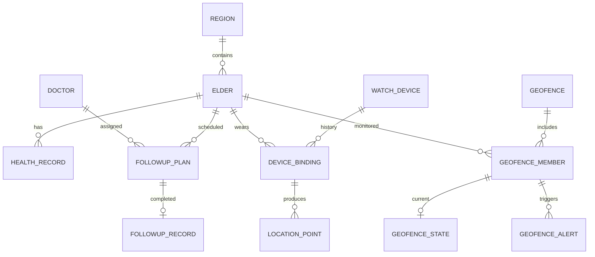

# 数据库与接口草案

版本 0.1，配套《需求与设计评审》，设计待确认，尚未执行建表或连接数据库。

## 1 数据实体

所有业务主键拟用 BIGINT 自增，API 将 ID 输出为字符串，避免 JavaScript 精度问题。字符串使用 utf8mb4；经纬度分别使用 DECIMAL(10,7)、DECIMAL(11,7)，取值范围经纬分别为 [-180,180] 和 [-90,90]。业务表具有创建和修改时间，需并发修改的表增加 version。枚举由后端校验；字段级类型、空值和约束在正式 SQL 中细化。

| 表 | 核心字段 | 约束或索引 |
| --- | --- | --- |
| sys_user | username password_hash display_name role enabled | username 唯一；禁用立即拒绝后续业务请求 |
| region | code name parent_id | code 唯一；parent_id 自关联 |
| elder | code name gender birth_date region_id phone status | code 唯一；region_id,status；归档保留历史 |
| doctor | code name department phone enabled | code 唯一 |
| health_rule | metric lower_bound upper_bound unit version enabled | metric,version 唯一；规则版本创建后不原位覆盖 |
| health_record | elder_id measured_at systolic diastolic heart_rate oxygen temperature abnormal rule_snapshot source event_id | elder_id,measured_at；measured_at,abnormal；source,event_id 唯一 |
| followup_plan | elder_id doctor_id due_at status canceled_at | doctor_id,due_at；elder_id,due_at |
| followup_record | plan_id completed_at content result | plan_id 唯一；completed_at |
| watch_device | serial_no model enabled last_seen_at | serial_no 唯一；last_seen_at |
| device_binding | device_id elder_id bound_at unbound_at | 设备及老人各自最多一个有效绑定；历史区间不可重叠 |
| location_point | device_id binding_id elder_id event_id longitude latitude recorded_at received_at | device_id,event_id 唯一；elder_id,recorded_at,id |
| geofence | name center_lon center_lat radius_m enabled version | radius_m > 0；第一版允许 50 至 5000 米 |
| geofence_member | fence_id elder_id enabled | fence_id,elder_id 唯一 |
| geofence_state | member_id last_point_id last_recorded_at inside active_alert_id | member_id 唯一；事务锁防止并发重复报警 |
| geofence_alert | member_id exit_point_id triggered_at returned_at closed_at close_reason handled_by handled_at handling_note | member_id,triggered_at；handled_at；告警几何版本快照 |
| audit_log | user_id action target_type target_id occurred_at result | user_id,occurred_at；不记录密码、Session 或完整健康内容 |

说明：geofence_alert.triggered_at 表示触发告警的时间，接口统一使用 triggeredAt；returned_at 表示检测到返回围栏的时间，两者不混用。

设备绑定由服务层事务串行校验，并拟通过“仅有效绑定具有非空唯一键”的数据库约束防止并发双重绑定。已有关联历史的老人、医生和设备采用归档或停用，不级联删除健康记录与轨迹。只允许删除无历史引用的误建记录。地理状态更新和告警产生需同一事务提交。

## 2 主要关系

## 3 接口公共契约

API 前缀 /api/v1。请求和响应 JSON 字段为 camelCase。成功响应为 {code:"OK",message:"成功",data:...}；错误响应保持该结构，附 requestId，data 为 null 或字段校验详情。HTTP 400 表示校验失败，401 未认证，403 无权限或 CSRF 校验失败，404 资源不存在，409 状态或唯一约束冲突，500 服务端异常。禁止将所有异常包装为 HTTP 200。

分页 page 从 1 开始，size 默认 20、上限 100；响应 data 包含 records、total、page、size。排序字段使用白名单，不接收 SQL 字符串。统计查询与对应明细共用筛选 DTO。健康及随访日期 start、end 成对提供，并校验 start < end。GET 请求不修改业务状态。

认证使用 Session Cookie。前端先获取 CSRF 令牌，再提交登录及其他写请求；登录后更新令牌。Cookie 生产环境设置 HttpOnly、Secure、SameSite，空闲超时拟为 30 分钟。开发代理提供同源路径。

## 4 接口目录

下列为评审级契约；请求体细节和响应字段将在实现前补为可机器校验的 OpenAPI，并与测试同步。

| 方法 | 路径 均省略前缀 | 输入和行为 | 权限 |
| --- | --- | --- | --- |
| GET | /auth/csrf | 获取 CSRF token 和 headerName | 匿名 |
| POST | /auth/login | username,password；建立会话 | 匿名及 CSRF |
| GET | /auth/me | 当前账号角色 | 登录 |
| POST | /auth/logout | 注销会话 | 登录 |
| GET | /dashboard | regionId,start,end；汇总指标 | 登录 |
| GET | /regions | 地区树 | 登录 |
| GET,POST | /elders | 分页筛选或新增档案 | 查看登录；写业务角色 |
| GET,PUT | /elders/{id} | 详情或更新，更新带 version | 查看登录；写业务角色 |
| POST | /elders/{id}/archive | 归档，终止有效设备绑定和围栏监测 | 业务角色 |
| GET | /statistics/population | regionId；当前在册人口统计 | 登录 |
| GET,POST | /health-records | 列表或录入检测；至少一项指标 | 查看登录；写业务角色 |
| GET | /statistics/health | regionId,start,end；次数和去重人数 | 登录 |
| GET | /elders/{id}/health-trend | metric,start,end；按时间返回 | 登录 |
| GET,POST | /doctors | 医生列表或新增 | 查看登录；写业务角色 |
| PUT | /doctors/{id} | 编辑或停用医生 | 业务角色 |
| GET,POST | /followup-plans | 查询或新建计划 | 查看登录；写业务角色 |
| POST | /followup-plans/{id}/complete | completedAt,content,result；事务写完成记录 | 业务角色 |
| POST | /followup-plans/{id}/cancel | reason；拒绝已完成计划 | 业务角色 |
| GET | /statistics/followups | regionId,doctorId,start,end；完成率 | 登录 |
| GET,POST | /devices | 列表或新增设备 | 查看登录；写业务角色 |
| PUT | /devices/{id} | 更新或停用设备，停用需解绑 | 业务角色 |
| POST | /devices/{id}/bind | elderId；冲突返回 409 | 业务角色 |
| POST | /devices/{id}/unbind | 结束有效绑定，不删除历史 | 业务角色 |
| GET | /devices/distribution | regionId,status；最新位置和心跳 | 登录 |
| GET,POST | /geofences | 列表或创建圆形围栏 | 查看登录；写业务角色 |
| PUT | /geofences/{id} | 中心半径和状态，携带 version | 业务角色 |
| PUT | /geofences/{id}/members | elderIds；事务更新人员关联 | 业务角色 |
| GET | /geofence-alerts | handled,elderId,start,end；事件列表 | 登录 |
| POST | /geofence-alerts/{id}/handle | note,version；重复处理返回 409 | 业务角色 |
| GET | /elders/{id}/trajectory | start,end；按时间排序，最多 24 小时和 5000 点 | 登录 |
| GET,POST | /users | 账号列表或创建 | 管理员 |
| PUT | /users/{id} | 角色、显示名、启停；防止停用最后管理员 | 管理员 |
| POST | /users/{id}/reset-password | 新密码；使该账号原会话失效 | 管理员 |
| POST | /demo/locations | 模拟定位事件批次，走正常入库与围栏服务 | 管理员且 demo |
| POST | /demo/heartbeats | deviceId,eventId,recordedAt；更新心跳 | 管理员且 demo |

业务角色指 ADMIN 或 OPERATOR。所有写接口均校验 CSRF、字段范围和关联对象有效性，权限取服务端认证上下文，不接收客户端伪造的角色。

## 5 一条可验收业务链

管理员登录 → 创建老人 → 注册并绑定腕表 → 为老人设置圆形围栏 → 提交范围内模拟点 → 提交范围外点 → 告警列表出现一次越界 → 再提交范围外点不重复创建 → 提交范围内点记录返回时间 → 业务人员处理告警 → 轨迹回放显示这些点 → 分析员可以查看但不能修改。

## 6 测试关注点

统计空集合、未知年龄、时间边界、分母为零；权限绕过与注销会话；并发设备绑定；重复定位、乱序定位与解绑换绑；围栏边界、首点在外、持续越界、返回再离开；轨迹点数和时段限制；模拟端点在非 demo 环境不可用。将这些场景分配测试编号，执行证据生成后再填写测试日志。
